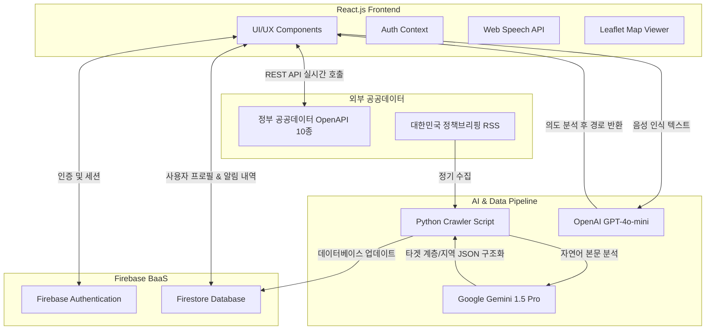

# PublicMind (퍼블릭마인드) - 초개인화 공공데이터 통합 플랫폼

대한민국 전역에 흩어져 있는 공공데이터(복지, 재난, 교통, 보건 등 10여 개 분야)를 단일 웹 플랫폼으로 통합하고, **인공지능(LLM)을 활용해 사용자 프로필 기반 맞춤형 알림과 음성 의도 파악 라우팅을 제공하는 지능형 슈퍼앱**입니다.

## 1. 프로젝트 기획 및 설계 배경

### 1.1 사용자 페인 포인트 (Pain Points)
- **정보의 파편화와 높은 탐색 비용**: 청년 지원금은 '복지로', 실시간 도로는 '국토교통부', 재난 경보는 '국민재난안전포털' 등 정보가 분산되어 있어 접근성이 매우 떨어짐.
- **비구조화된 정책 데이터**: 정부의 정책 공문이나 RSS 피드는 복잡한 자연어(줄글)로 작성되어 있어, 사용자가 본인에게 혜택이 적용되는지 파악하기 위해 긴 글을 직접 독해해야 함.
- **불편한 UX/UI**: 기존 공공기관 서비스는 메뉴 뎁스(Depth)가 깊고 모바일 최적화가 부족하며 검색 기능이 제한적임.

### 1.2 서비스 해결 방안 (Solution)
- **통합 대시보드 구축**: 10개 이상의 공공 OpenAPI를 하나의 뷰에서 직관적으로 소비할 수 있는 반응형 하이브리드 웹 구현.
- **초개인화 필터링 자동화 (Python + AI)**: 백엔드 크롤러가 정책 데이터를 수집하고 LLM을 통해 메타데이터를 추출(구조화)하여, 유저 프로필과 매칭되는 정보만 선별 푸시.
- **음성 인식 기반 AI 비서**: 복잡한 메뉴 탐색 없이 "나 오늘 전세금 대출 알아보고 싶어"라는 자연어 음성만으로 최적의 서비스 페이지로 라우팅.

---

## 2. 시스템 아키텍처 및 설계 (System Architecture)

전체 시스템은 크게 **프론트엔드(React)**, **BaaS(Firebase)**, **AI 데이터 파이프라인(Python)** 3가지 축으로 분리되어 비동기적으로 동작하도록 마이크로서비스(MSA) 형태로 설계되었습니다.

---

## 3. 핵심 기술 및 AI 도입 상세 (Core Tech & AI)

본 프로젝트의 가장 큰 차별점은 단순한 공공데이터 뷰어를 넘어, 데이터 전처리와 UX 향상 과정에 생성형 AI를 깊숙이 결합했다는 점입니다.

### 3.1 초개인화 정책 크롤링 파이프라인 (Data Pipeline with AI)
**왜 크롤링 봇에 AI를 결합했는가?**
일반적인 크롤러는 키워드(예: '청년')가 본문에 있는지 여부만 판단할 수 있습니다. 하지만 "청년을 제외한 모든 계층 지원"이라는 문장이 있을 경우 단순 키워드 매칭은 심각한 오류를 범합니다. 이를 해결하기 위해 추론 능력이 있는 LLM을 도입했습니다.

- **작동 원리 (Python 기반)**
  1. `feedparser`와 `requests`를 사용해 '대한민국 정책브리핑' 등 주요 정부 RSS 피드를 실시간으로 긁어옵니다. (이 과정에서 공공기관 서버의 크롤링 봇 차단을 우회하기 위해 `User-Agent` 헤더 최적화 적용).
  2. HTML 태그가 섞인 원문을 정규식(`re`)을 통해 순수 텍스트로 클렌징 처리.
  3. 클렌징된 본문을 **Google Gemini API**에 전달하며 정교한 프롬프트(Prompt)를 주입합니다.
     - *프롬프트 내용*: "이 문서를 분석하여 수혜 대상(targets)을 ['청년', '소상공인', '전체' 등] 배열로 추출하고 1줄 요약(summary)을 JSON 형태로 반환하라."
  4. AI가 응답한 JSON 데이터를 검증한 뒤, `firebase-admin` SDK를 통해 Firestore DB에 `policies` 컬렉션 문서로 저장합니다.
- **프론트엔드 연동**: 리액트 앱은 Firestore를 구독(Subscribe)하다가 새로운 정책이 올라오면, 현재 로그인된 사용자의 DB 프로필 조건과 AI가 파싱한 `targets` 배열의 교집합을 연산하여 일치할 경우에만 UI에 알림을 띄웁니다.

### 3.2 AI 음성 라우팅 엔진 (Voice Navigation)
- **작동 원리**
  1. 프론트엔드의 커스텀 훅(`useSpeechRecognition`)을 통해 브라우저 네이티브 Web Speech API를 호출, 사용자의 음성을 실시간 텍스트로 변환(STT)합니다.
  2. 텍스트가 완성되면 **OpenAI API (GPT-4o-mini)**로 전송합니다.
  3. LLM은 사전 주입된 System Prompt에 따라 사용자의 모호한 의도(예: "집주인이 돈 안 주는데 어떡해?")를 정확한 도메인(예: `/real-estate` 부동산 카테고리)으로 판단하여 단일 URL 텍스트만 응답합니다.
  4. React Router가 해당 URL로 즉시 화면을 전환합니다.
- **기술적 트러블슈팅**: 리액트의 `useEffect` 생명주기와 Speech API 인스턴스가 충돌하여 마이크가 즉시 꺼지는 무한 렌더링 루프 버그가 발생했습니다. 이를 해결하기 위해 `useRef`를 활용해 콜백 함수들을 고정(Stable reference)시키고 컴포넌트 마운트 상태를 분리하여 마이크 안정성을 극대화했습니다.

---

## 4. UI/UX 설계 및 프론트엔드 구현 (Frontend Implementation)

디지털 소외 계층도 쉽게 사용할 수 있으면서도 모던한 느낌을 주기 위해 **Glassmorphism(유리 질감)**과 **3D 애니메이션**을 주요 디자인 언어로 채택했습니다.

### 4.1 3D 커버플로우(Coverflow) 네비게이션
- 8개의 방대한 카테고리를 화면에 나열하면 복잡도가 올라갑니다. 이를 방지하기 위해 CSS `transform: rotateZ`와 `z-index` 동적 계산 알고리즘을 활용하여 카드가 원형 궤도를 도는 형태의 무한 롤링 커버플로우를 구현했습니다.
- 유저는 스크롤 압박 없이 화면 중앙에서 모든 카테고리를 입체적으로 탐색할 수 있습니다.

### 4.2 지도 시각화 (React-Leaflet)
- **글로벌 재난/안전 대시보드**: 외교부의 ISO 국가 코드 데이터를 파싱한 뒤 좌표로 매핑하여 Leaflet 지도 위에 커스텀 애니메이션 마커(Pulse effect)로 시각화했습니다. 위험 단계(1~4단계)에 따라 색상이 동적으로 변경됩니다.
- 사용자가 마커를 클릭하면 지도가 해당 좌표로 부드럽게 이동(FlyTo)하며 해당 국가의 상세 행동 지침을 보여주는 패널이 확장됩니다.

### 4.3 상태 관리 및 성능 최적화
- **Auth Context**: Firebase Auth를 React Context API와 결합하여 전역 상태로 관리, 로그인 여부에 따라 Private 라우팅 처리를 구현했습니다.
- **Glow Hover Effect**: 마우스 포인터의 위치(X, Y)를 계산하여 CSS 변수(`--mouse-x`)로 전달해, 카드 컴포넌트에 마우스를 올렸을 때 빛이 따라다니는 듯한 고급스러운 마이크로 인터랙션을 JS와 CSS의 결합으로 최적화하여 구현했습니다.

---

## 5. 서비스 주요 도메인 (Key Features)

| 서비스 명칭 | 활용 데이터 및 기능 설명 |
|---|---|
| **마이페이지 (맞춤 알림)** | 내 프로필(나이/가구형태) 설정 및 AI 크롤러가 매칭한 실시간 정책 알림 수신 |
| **통합 AI 어시스턴트** | 전체 시스템의 가이드 역할 및 대화형 질의응답 챗봇 (Markdown 렌더링 지원) |
| **복지/지원금 조회기** | 정부 보조금24 API를 활용한 전국/지자체별 복지 혜택 리스트업 및 조건 필터 |
| **부동산/입지 분석기** | 국토교통부 실거래가 오픈 API 기반, 예산에 맞는 전월세 및 안심 상권 분석 |
| **글로벌 재난 대시보드** | 외교부 해외안전여행 API 연동, 위험 국가 지도 시각화 및 대사관 연락처 제공 |
| **보건/의료 내비게이션** | 공공데이터포털 기반 심야 공공약국, 병원 등급 및 건강검진 기관 위치 탐색 |
| **실시간 도로/CCTV** | 국가교통정보센터(ITS) API 기반 전국 고속도로 소통 현황 및 CCTV 영상 송출 |
| **환경/재난 알리미** | 에어코리아 실시간 미세먼지 수치 및 지진/민방위 대피소 위치 정보 |
| **교육 및 문화 가이드** | 문화체육관광부 공연/축제 현황 및 지역별 학군/어린이집 인프라 정보 |

---

## 6. 사용된 기술 스택 (Tech Stack)

- **Frontend**: React.js, Vite, React Router DOM, React-Leaflet (Map), Lucide React (Icons), CSS Modules
- **Backend**: Firebase Authentication, Cloud Firestore (NoSQL)
- **AI & Data Pipeline**: Python 3.8+, Google Generative AI (Gemini 1.5 Pro), OpenAI API (GPT-4o-mini), `feedparser`, `requests`
- **Deployment & Version Control**: Git, GitHub, (호스팅 예정: Vercel / Firebase Hosting)
