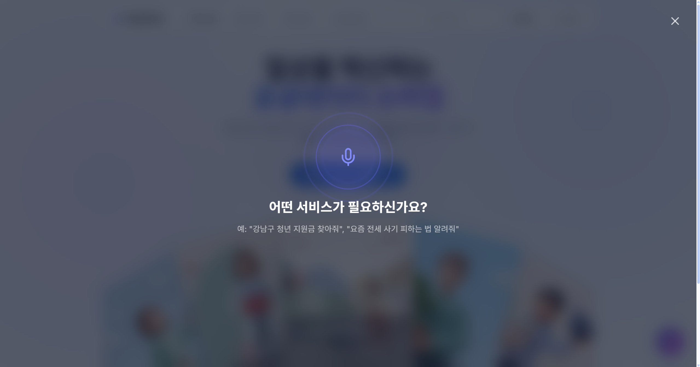
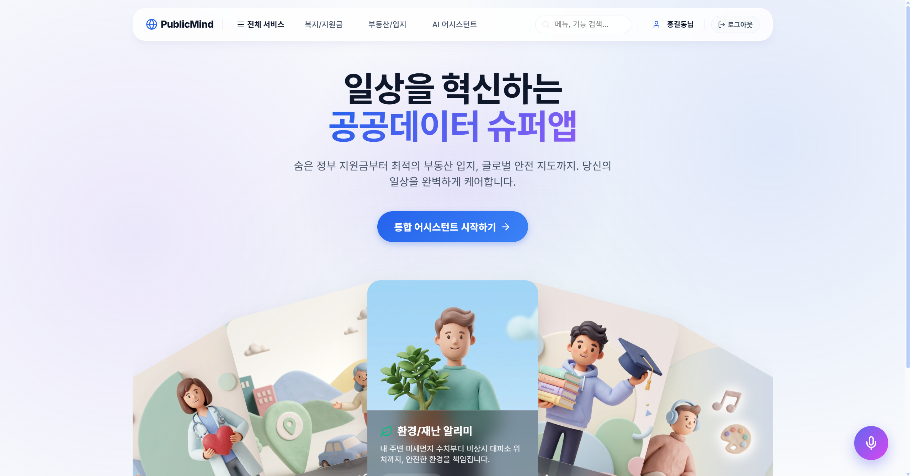
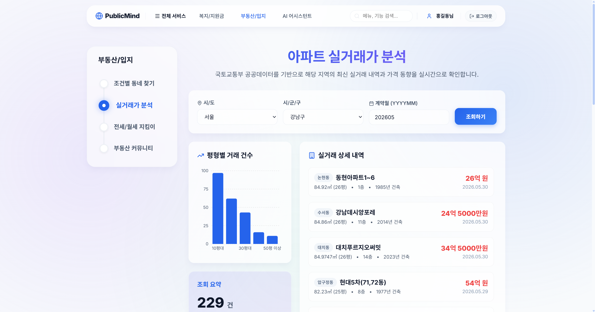
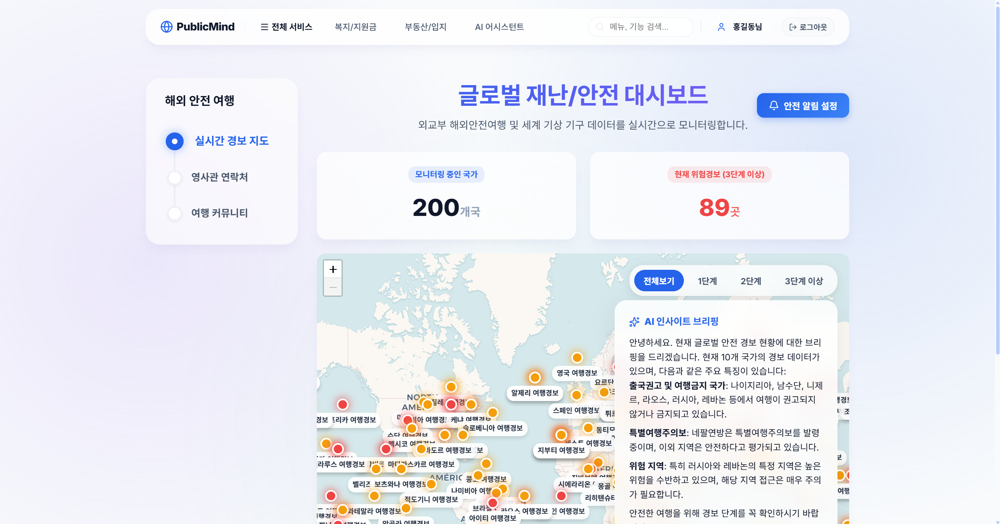
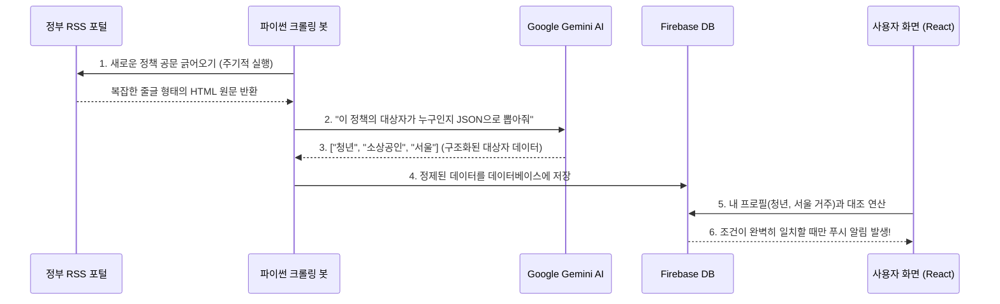
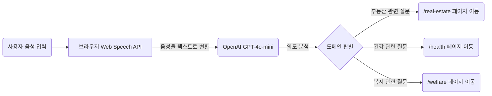

# PublicMind (퍼블릭마인드)



> **"AI가 당신의 상황을 이해하고, 당신에게 딱 맞는 공공 혜택을 찾아줍니다."**
> 
> 대한민국 전역에 흩어져 있는 10여 개의 공공데이터(복지, 재난, 부동산, 보건 등)를 단일 플랫폼으로 통합하고, 인공지능(LLM)을 활용해 **초개인화된 맞춤 알림**과 **음성 라우팅**을 제공하는 지능형 슈퍼앱 프로젝트입니다.

---

## 1. 프로젝트 한눈에 보기 (Overview)

- **개발 기간**: 2024.05 ~ 2024.06
- **개발 인원**: 1인 풀스택 (기획, UI/UX 디자인, 프론트엔드, 파이어베이스 백엔드, 파이썬 AI 크롤링)
- **핵심 목표**: 복잡한 공공기관 사이트들의 정보 파편화 문제를 해결하고, 디지털 소외 계층도 쉽게 접근할 수 있는 혁신적인 UI/UX 제공.

---

## 2. 서비스 핵심 화면 (Screenshots)

<table>
  <tr>
    <th width="50%">2.1 메인 대시보드 (통합 AI 어시스턴트)</th>
    <th width="50%">2.2 마이페이지 (초개인화 맞춤 분석)</th>
  </tr>
  <tr>
    <td align="center"></td>
    <td align="center"></td>
  </tr>
  <tr>
    <td>
      <ul>
        <li><b>3D 커버플로우 UI</b>: 방대한 공공데이터 카테고리를 직관적이고 입체적으로 탐색할 수 있습니다.</li>
        <li><b>음성 인식 비서</b>: 하단의 마이크 버튼을 통해 자연어로 질문하면 AI가 의도를 파악하여 적합한 서비스로 즉시 안내합니다.</li>
      </ul>
    </td>
    <td>
      <ul>
        <li><b>프로필 기반 AI 매칭</b>: 사용자의 나이, 거주지, 직업, 가구 형태를 기반으로 꼭 맞는 정책과 지원금을 필터링합니다.</li>
        <li><b>결과 리포트 제공</b>: 수많은 공공데이터 중 혜택을 받을 수 있는 알짜 정보만 모아 대시보드 형태로 제공합니다.</li>
      </ul>
    </td>
  </tr>
  <tr>
    <th width="50%">2.3 글로벌 재난/안전 대시보드</th>
    <th width="50%">2.4 아파트 실거래가 분석</th>
  </tr>
  <tr>
    <td align="center"></td>
    <td align="center"></td>
  </tr>
  <tr>
    <td>
      <ul>
        <li><b>실시간 위험 경보 지도</b>: 외교부 데이터를 연동하여 전 세계 위험 지역을 인터랙티브 지도로 한눈에 파악합니다.</li>
        <li><b>AI 인사이트 브리핑</b>: 현재 발령 중인 특별여행주의보 및 출국권고 국가를 AI가 요약하여 리포팅해 줍니다.</li>
      </ul>
    </td>
    <td>
      <ul>
        <li><b>국토교통부 데이터 연동</b>: 원하는 시/군/구를 선택하여 해당 지역의 최신 아파트 매매 기록을 실시간으로 확인합니다.</li>
        <li><b>데이터 시각화</b>: 평형별 거래 건수를 막대그래프로 시각화하여 지역별 부동산 동향을 직관적으로 분석합니다.</li>
      </ul>
    </td>
  </tr>
</table>

---

## 3. 기획 배경 (Why did we build this?)

### 문제점 (Problem)
1. **"나한테 맞는 지원금은 어디서 찾지?"**: 청년 혜택, 소상공인 지원금 등이 부처별로 다 흩어져 있습니다.
2. **"이거 내가 받을 수 있는 조건인가?"**: 정부 공문은 긴 글로 되어 있어 내가 대상자인지 파악하기가 너무 어렵습니다.
3. **"메뉴가 너무 많고 복잡해!"**: 공공기관 사이트는 원하는 메뉴를 찾기 위해 클릭을 수없이 해야 합니다.

### 해결책 (Solution)
1. **데이터 통합**: 국토부, 외교부, 보건복지부 등 10여 개 기관의 API를 끌어와 한곳에 모았습니다.
2. **AI 초개인화 필터링**: 파이썬 봇이 정책을 읽고, AI(Gemini)가 조건을 해석하여 나에게 딱 맞는 혜택만 쏙쏙 뽑아 알려줍니다.
3. **AI 음성 내비게이션**: "오늘 미세먼지 어때?"라고 말하기만 하면 AI가 알아서 해당 페이지로 화면을 이동시켜 줍니다.

---

## 4. 어떻게 작동하나요? (How it works)

### 4.1 초개인화 정책 매칭 시스템 (AI 크롤링 파이프라인)
매일 쏟아지는 수백 개의 정부 정책을 어떻게 나에게 맞춰서 보내줄까요?



### 4.2 음성 인식 인공지능 비서 (Voice Routing)
복잡한 메뉴판 대신, 말 한마디로 원하는 정보를 찾아가는 과정입니다.



---

## 5. 전체 시스템 아키텍처 (System Architecture)

프론트엔드와 백엔드, 그리고 데이터 수집기가 독립적으로 통신하는 마이크로서비스(MSA) 기반의 구조입니다.

```mermaid
graph TD
    subgraph Frontend [React.js Frontend (Vite)]
        UI[Glassmorphism UI]
        Map[Leaflet Interactive Map]
        Voice[Web Speech API]
    end

    subgraph Backend [Firebase]
        Auth[인증 관리 (Auth)]
        FS[실시간 데이터베이스 (Firestore)]
    end

    subgraph AI_Data_Pipeline [AI Data Pipeline (Python)]
        Crawler[RSS Feed Crawler]
        OpenAI[의도 파악 GPT-4o-mini]
        Gemini[문서 요약 Gemini 1.5 Pro]
    end

    subgraph Public_APIs [10+ Public APIs]
        GovData[정부24, 국토교통부, 환경공단 등]
    end

    UI <--> |사용자 정보 및 알림 조회| FS
    UI <--> |실시간 정보 (미세먼지, 부동산 등)| GovData
    UI --> |음성 명령 텍스트 전송| OpenAI
    OpenAI --> |이동할 페이지 URL 반환| UI
    Crawler --> |자연어 문서 전달| Gemini
    Gemini --> |타겟 메타데이터 JSON 반환| Crawler
    Crawler --> |DB 업데이트| FS
```

---

## 6. 겪었던 문제점과 해결 과정 (Troubleshooting)

### 이슈 1: 마이크를 켜자마자 바로 꺼지는 무한 렌더링 버그
- **문제 발생**: 리액트(React) 컴포넌트 내부에 음성 인식(Speech API) 훅을 구현했는데, 음성이 인식되어 화면에 글자가 업데이트될 때마다 전체 화면이 새로고침되면서 마이크 객체가 파괴되는 현상(무한 루프)이 발생했습니다.
- **해결 과정**: 컴포넌트 생명주기와 독립적으로 상태를 유지하기 위해 `useRef`를 도입했습니다. 콜백 함수들을 고정된 메모리 주소(Stable reference)에 바인딩하여, 화면이 수백 번 새로고침 되더라도 마이크 연결이 끊어지지 않도록 최적화했습니다.

### 이슈 2: 단순 키워드 검색의 한계 (정부 정책의 모호함)
- **문제 발생**: 처음엔 파이썬 봇이 본문에 '청년'이라는 단어가 있으면 무조건 청년 알림으로 보냈습니다. 하지만 "이 정책은 청년에게는 해당되지 않습니다"라는 문장에서도 알림이 가는 치명적인 논리 오류가 발생했습니다.
- **해결 과정**: 단순 텍스트 크롤링을 포기하고, 문맥을 100% 이해할 수 있는 Google Gemini LLM을 크롤링 봇에 결합했습니다. 봇이 수집한 문장을 LLM에게 넘겨 "수혜 대상을 정확히 배열(Array)로 뽑아줘"라고 프롬프트를 작성하여, 인간의 독해력 수준으로 타겟을 정확히 분리하는 데 성공했습니다.

---

## 7. 기술 스택 (Tech Stack)

### Frontend
- **Framework**: React.js (Vite)
- **Routing & State**: React Router DOM, React Context API
- **Design & UI**: CSS Modules (Glassmorphism, 3D Coverflow), Lucide-React
- **Visualization**: React-Leaflet (지도 데이터 매핑)

### Backend & AI
- **Database**: Firebase (Auth, Firestore)
- **Data Pipeline**: Python 3.8+ (requests, feedparser, re)
- **AI Models**: Google Gemini 1.5 Pro (데이터 파싱), OpenAI GPT-4o-mini (음성 라우팅)

### Public APIs Used
- 대한민국 정책브리핑 RSS
- 외교부 해외안전여행 OpenAPI
- 국토교통부 실거래가 및 안심상권 API
- 보건복지부 복지서비스 OpenAPI
- 국가교통정보센터(ITS) 고속도로 CCTV 실시간 API
- 한국환경공단 실시간 대기오염(미세먼지) API 등 10여 종 활용
